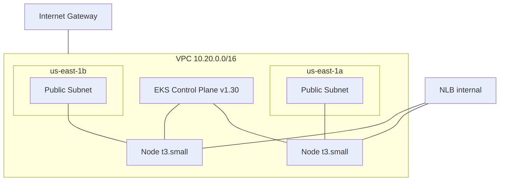

# fiap-fase3-infra-k8s

> Parte do Tech Challenge FIAP — Pós-graduação Software Architecture (14SOAT) — **Fase 3**.

## Propósito

Provisiona via **Terraform** toda a infraestrutura Kubernetes na AWS para a Fase 3:
- VPC custom com 2 subnets públicas (us-east-1a, us-east-1b)
- Cluster Amazon **EKS** v1.30 com managed nodegroup (`t3.small` × 2-3)
- **NGINX Ingress Controller** (Helm) exposto via Network Load Balancer interno
- **Grafana Alloy** (Helm) para coleta de métricas/logs/traces para Grafana Cloud

## Arquitetura



## Tecnologias

| Categoria | Stack |
|-----------|-------|
| IaC | Terraform 1.6+ |
| Cloud | AWS (us-east-1) |
| K8s | Amazon EKS 1.30 |
| Ingress | NGINX (Helm) |
| Observabilidade | Grafana Alloy (DaemonSet) |
| State | S3 + DynamoDB lock |
| CI/CD | GitHub Actions |

## Setup local

> ⚠️ Em construção. Ver [plano 05](../plans/fase-3/05-infra-k8s-eks.md).

```bash
# Configurar profile AWS
export AWS_PROFILE=fiap

# Inicializar e aplicar
cd terraform
terraform init
terraform plan
terraform apply

# Configurar kubectl
aws eks update-kubeconfig --name fiap-fase3-eks --region us-east-1
kubectl get nodes
```

## Outputs (state remoto)

Outros repos consomem via `terraform_remote_state`:

- `vpc_id`
- `subnet_ids`
- `eks_cluster_name`
- `eks_endpoint`
- `nlb_dns`
- `nlb_zone_id`

## Restrições do AWS Academy

- Roles fixas: `LabEksClusterRole` (cluster + nodes)
- Region: `us-east-1`
- Instances: até `t3.large`
- Sem IRSA (OIDC bloqueado) — pods herdam role do node

## Repositórios da Fase 3

- [`fiap-fase3-app`](https://github.com/arthurfcs98/fiap-fase3-app) — API principal
- [`fiap-fase3-auth-lambda`](https://github.com/arthurfcs98/fiap-fase3-auth-lambda) — Lambda auth
- [`fiap-fase3-infra-k8s`](https://github.com/arthurfcs98/fiap-fase3-infra-k8s) ← você está aqui
- [`fiap-fase3-infra-db`](https://github.com/arthurfcs98/fiap-fase3-infra-db) — RDS Terraform

## Autor

Arthur Freitas Cesarino dos Santos — RM369347
