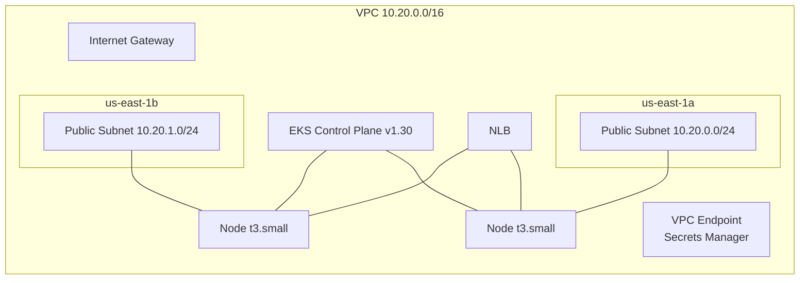

# fiap-fase3-infra-k8s

> **Tech Challenge FIAP — Pós-graduação Software Architecture (14SOAT) — Fase 3**

Provisiona via **Terraform** a infraestrutura Kubernetes da Fase 3 na AWS.

[](https://github.com/arthurfcs98/fiap-fase3-infra-k8s/actions/workflows/terraform.yml)

## O que provisiona

- **VPC** `10.20.0.0/16` com 2 subnets públicas (us-east-1a/1b), IGW e route table
- **Amazon EKS** v1.30 com control plane público, `bootstrap_cluster_creator_admin_permissions`
- **Managed nodegroup** `t3.small` × 2 (auto-scaling 1-3), AMI AL2023
- **NGINX Ingress Controller** via Helm v4.11.3, exposto via Network Load Balancer
- **VPC Endpoint** pra Secrets Manager (necessário pra Lambdas em VPC sem NAT)

## Arquitetura



## Stack

| Categoria | Tech |
|-----------|------|
| IaC | Terraform 1.6+ |
| Cloud | AWS (us-east-1) |
| K8s | Amazon EKS 1.30 |
| Nodes | t3.small × 2 (AL2023, on-demand) |
| Ingress | NGINX Ingress Controller (Helm) + NLB |
| State | S3 + DynamoDB lock |

## Estrutura

```
fiap-fase3-infra-k8s/
├── terraform/
│   ├── backend.tf            # S3 backend
│   ├── providers.tf          # aws, kubernetes, helm
│   ├── versions.tf
│   ├── variables.tf
│   ├── outputs.tf            # vpc_id, subnet_ids, cluster_name, nlb_dns, ...
│   ├── main.tf               # orquestra módulos
│   └── modules/
│       ├── vpc/              # VPC + IGW + subnets + endpoints.tf (VPCE SM)
│       ├── eks/              # cluster + nodegroup + data sources LabEks roles
│       └── ingress/          # helm release NGINX
├── envs/
│   ├── homolog/terraform.tfvars
│   └── prod/terraform.tfvars
└── .github/workflows/
    └── terraform.yml         # plan em PR; apply em main/homolog
```

## Outputs (consumidos por outros repos)

Via `data "terraform_remote_state"` no bucket S3 compartilhado:

- `vpc_id`, `subnet_ids`, `vpc_cidr`
- `cluster_name`, `cluster_endpoint`, `cluster_ca_certificate`
- `nlb_dns`, `nlb_hosted_zone_id`
- `kubectl_config_command`

## Setup local

```bash
export AWS_PROFILE=fiap

cd terraform
terraform init
terraform plan -var-file=../envs/homolog/terraform.tfvars
terraform apply -var-file=../envs/homolog/terraform.tfvars

# Configurar kubectl
aws eks update-kubeconfig --name fiap-fase3-eks --region us-east-1 --profile fiap
kubectl get nodes
```

## Decisões arquiteturais relevantes

- **VPC sem NAT Gateway:** subnets públicas com `map_public_ip_on_launch = true`. Economiza ~$32/mês mas exige VPC Endpoints pra cada serviço AWS que Lambdas em VPC precisam acessar (Secrets Manager está incluído).
- **EKS access via bootstrap admin:** `bootstrap_cluster_creator_admin_permissions = true`. Cria EKS Access Entry automática pro caller (`voclabs`), sem precisar de `aws_eks_access_entry` explícito.
- **NGINX Ingress (não AWS LBC):** AWS Load Balancer Controller exige IRSA (bloqueado no Academy). NGINX funciona com cluster IP service + NLB.
- **`scheme: internet-facing` no NLB:** internal seria ideal pra VPC Link, mas o in-tree CCM não permite mudar scheme em recurso existente. API Gateway usa `connection_type = INTERNET` no `fiap-fase3-app/terraform/gateway/`.

Detalhes em [ADRs](https://github.com/arthurfcs98/fiap-fase3-app/blob/main/docs/adrs/) do repo `fiap-fase3-app`.

## Restrições do AWS Academy aplicadas

- Roles `LabEksClusterRole`/`LabEksNodeRole` têm prefixo gerado → descobertas via `aws_iam_roles { name_regex }`
- `iam:GetRole` bloqueado em `voclabs` → ARN do admin construído manualmente via `split` do caller identity
- Sem IRSA (OIDC bloqueado)
- Sem alteração de scheme do NLB em recurso existente

## Repositórios da Fase 3

- [fiap-fase3-app](https://github.com/arthurfcs98/fiap-fase3-app) — API principal + docs centrais
- [fiap-fase3-auth-lambda](https://github.com/arthurfcs98/fiap-fase3-auth-lambda) — Lambda auth
- **[fiap-fase3-infra-k8s](https://github.com/arthurfcs98/fiap-fase3-infra-k8s)** (este)
- [fiap-fase3-infra-db](https://github.com/arthurfcs98/fiap-fase3-infra-db) — RDS

## Autor

Arthur Freitas Cesarino dos Santos — RM369347
